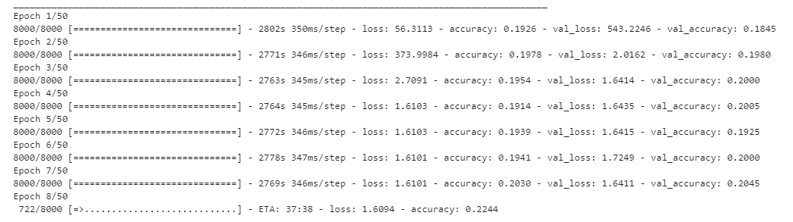
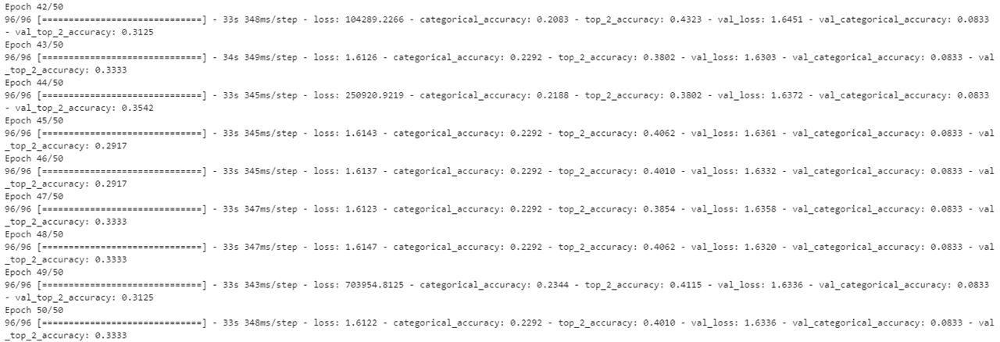

# Diabetic Retinopathy Detection
### Duke BME 590L Deep Learning Final Project: From Alchemy Failure to Performance Analysis
### Dingzhe Zheng
This project started with the idea of using [Residual Attention Network for Image Classification](https://openaccess.thecvf.com/content_cvpr_2017/papers/Wang_Residual_Attention_Network_CVPR_2017_paper.pdf)for diabetic retinopathy(DR) detection. However, the model has convergence issue. Several methods being tried to solved the problem but none worked. Subsequently, [inception v3](https://arxiv.org/pdf/1512.00567.pdf), [inception resnet v2](https://arxiv.org/pdf/1602.07261.pdf), and [Xception](https://arxiv.org/pdf/1610.02357.pdf). Models are trained on 2019 APTOS dataset due to time constraints. Attention module, preprocessing methods were later added to the model to compare their effects on each model's performance. You may turn them on and off by following the instructions in the code. Eventually, I tried binary classification on DR.
### Dataset
The datasets being used in this projects are [Kaggle 2015 Diabetic Retinopathy Detection](https://www.kaggle.com/c/diabetic-retinopathy-detection) and [Kaggle APTOS 2019 Blindness Detection](https://www.kaggle.com/c/aptos2019-blindness-detection/discussion). For convenience, you may download the resized 2015 & 2019 dataset from [Resized 2015 & 2019 Blindness Detection Images](https://www.kaggle.com/benjaminwarner/resized-2015-2019-blindness-detection-images).
### Results
##### Comparing 3 models
Model Name|Loss|Top-1 Accuracy|Top-2 Accuracy
----------|----|--------------|--------------
Inception v3|1.4375|0.6319|0.7904
Xception|1.9854|0.6504|0.8143
Inception Resnet v2|2.2184|0.6822|0.8086
##### Models with and without attention module
Model Name|Loss|Top-1 Accuracy|Top-2 Accuracy
----------|----|--------------|--------------
Inception v3|1.4375|0.6319|0.7904
Inception v3 + attention|2.9522|0.5936|0.7860
Xception|1.9854|0.6504|0.8143
Xception + attention|4.0186|0.6290|0.8027
##### Cropping the image
Model Name|Loss|Top-1 Accuracy|Top-2 Accuracy
----------|----|--------------|--------------
Xception|3.3432|0.6413|0.8040
Xception + autocrop|4.5536|0.7037|0.8372
##### Ben Graham's approach
Model Name|Loss|Top-1 Accuracy|Top-2 Accuracy
----------|----|--------------|--------------
Inception Resnet v2|0.5284|0.6641|0.8078
Inception Resnet v2 + Graham|4.0250|0.6353|0.8238
Xception|1.9854|0.6504|0.8143
Xception + Graham|4.2289|0.5745|0.8197
##### Binary Classification
Test|Loss|Accuracy
----|----|--------
validation|0.0214|0.9918
2015 train|2.2732|0.8185
### Findings
1. Inception Resnet v2 and Xception have better performance than inception as expected;
2. Attention module made it easier for each model to over-fitting the dataset, but did not necessarily improve the test results.
3. By adding more trainable parameters, we can easily overfit the dataset, but more trainable parameters do not help improve the  performance.
4. Cropping the image did help to improve the accuracy
5. Changing the color and adding Gaussian blur as from Ben's method did not help improve the accuracy
### Future Direction
1. Several methods have being tried to make Residual Attention Network work - tried different loss function, activation fucntion, tried modifying the model's structure, tried to pretrain on a small subset. The first picture below shows the issue of this network while training.You may notice that this network barely learned anything from the dataset. The second picture shows the pretrainin results. Root cause has not been located. May try to visualize the output from each layers to help locate the issue.

2. The trained models were only trained on a small dataset with ony 3993 images. You may continue my work by loading the models and the corresponding trained weights in _trained results_.
Note: it may take a few days to train on the 2015 dataset.
3. The preprocessing methods were not optimized. The speed was slowed almost by twice once preprocessing was addded. You may use tensorflow functions to do the preprocessing job and it might speed up the process.
